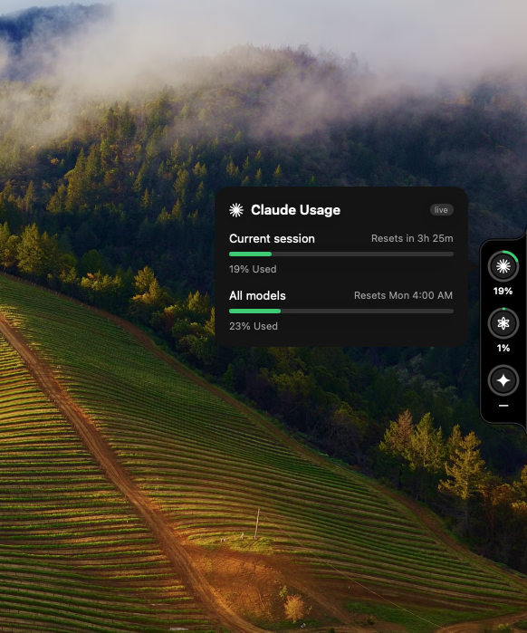

# Session Limit Tracker

[](https://github.com/ihamzarizvi/SessionLimitTracker/releases/latest)
[](https://github.com/ihamzarizvi/SessionLimitTracker/releases)
[](LICENSE)


**Ambient AI usage limits for macOS.** A menu-bar app and Samsung-style edge rail that
keeps your Claude, ChatGPT and Gemini usage limits permanently in view — so you stop
discovering the cap mid-task.

Claude meters two windows at once: a rolling **5-hour session** limit and a **weekly
all-models** limit, shared across web, desktop and Claude Code. The only way to see them
is to stop and run `/usage`. This app makes both ambient, and warns you before you're cut off.

<p align="center">
  
</p>

### ⬇︎ [Download the latest DMG](https://github.com/ihamzarizvi/SessionLimitTracker/releases/latest)

Open it, drag the app to Applications, then see [Install](#install) for the one-time
Gatekeeper step (the app is unsigned/ad-hoc, not notarised).

---

## Install

Download **[SessionLimitTracker-1.0.0.dmg](https://github.com/ihamzarizvi/SessionLimitTracker/releases/latest)**,
open it, and drag the app to Applications.

The app is ad-hoc signed but **not notarised** — notarisation needs a paid Apple
Developer Program membership. macOS therefore blocks it on first launch with
*"Apple could not verify 'Session Limit Tracker' is free of malware."*

**To open it anyway (macOS 15 Sequoia and later):**

1. Double-click the app once, then dismiss the warning.
2. Open **System Settings → Privacy & Security** and scroll to the bottom.
3. Click **Open Anyway** next to Session Limit Tracker and authenticate.

macOS 15 removed the old Control-click → **Open** shortcut, so that route only works
on macOS 14 Sonoma and earlier.

Alternatively, clear the quarantine flag in Terminal and it launches normally:

```bash
xattr -dr com.apple.quarantine "/Applications/Session Limit Tracker.app"
```

Building from source avoids the prompt entirely — locally built apps are never
quarantined.

Requires **macOS 14 or later on Apple silicon**. Runs as a menu-bar item with no
Dock icon.

## Features

- **Menu-bar item + popover** — Claude's session and weekly bars with live reset countdowns.
- **Edge rail** — a dark, flush-mounted dock of provider rings with concave fillets that
  bridge into the screen edge. Dock it left or right, drag it vertically, auto-hide it and
  expand on hover.
- **Hover detail** — hovering a ring pops a bubble with that provider's full breakdown.
- **Real numbers, honestly sourced** (see below) with an `estimated` / `live` badge.
- **Threshold alerts** — native notifications at 50/75/90/100% with quiet hours.
- **Watchlist** — choose which providers appear in the dock.
- **Dark / light / system** theming and a colorblind-safe palette.
- **Launch at login**, adjustable rail size and refresh interval.

## Where the numbers come from

This is the part most usage trackers are vague about, so it's spelled out.

| Provider | Source | Quality |
|---|---|---|
| **Claude** | `/api/oauth/usage`, using the token Claude Code stored | **live** — real shared-pool numbers matching `/usage` |
| **Claude** (default, no login) | parses `~/.claude/projects/**/*.jsonl` | **estimated** — this machine's Claude Code activity only |
| **ChatGPT** | rate limits Codex caches in `~/.codex/sessions/**` | **live** — real ChatGPT 5-hour + weekly limits, no extra requests |
| **Gemini** | local CLI session files, or Manual | best-effort |
| **Any** | Manual | user-entered cap, tracked locally |

**Honest limitations**

- The Claude usage endpoint is undocumented, and Anthropic's terms restrict third-party use
  of subscription OAuth tokens. That path is therefore **opt-in and consent-gated**; the app
  is fully functional on the compliant local estimator alone and falls back to it whenever
  the endpoint is unavailable.
- There is **no `claude` or `codex` CLI command that prints usage** — `/usage` is
  interactive-only — so the CLIs are used for auth verification, not for numbers.
- ChatGPT Plus and Gemini publish no consumer usage API. ChatGPT numbers come from Codex's
  own cached rate limits; without Codex, use Manual.
- OAuth sign-in requires **your own registered client ID**. No spoofed client credentials
  ship with this app.

## Connecting an account

Settings → **Providers** → **Connect…** runs a wizard: pick a method, authenticate, then it
reloads the saved connection and runs a real connection test before returning.

Methods: **detect Claude Code**, **detect Codex**, **OAuth** (Authorization Code + PKCE,
opened in your default browser via a localhost loopback redirect so it reuses your existing
login), **API key**, **paste session token**, or **Manual**.

Credentials live only in the macOS Keychain. Nothing is logged or sent off-device.

> Tip: `claude setup-token` → paste it into the Connect sheet gives you real Claude numbers
> with **zero** Keychain prompts, since it's stored in the app's own vault.

## Build

Requires macOS 14+ and a Swift 6 toolchain. No full Xcode needed.

```bash
swift build                 # compile
./Scripts/build-dmg.sh      # build the .app bundle and a distributable .dmg
```

`build-dmg.sh` renders the icon, assembles the bundle, signs it and packages the
DMG. To ship a notarised build, pass a Developer ID identity:

```bash
SIGN_IDENTITY="Developer ID Application: Your Name (TEAMID)" ./Scripts/build-dmg.sh
```

Unit tests use XCTest and need **full Xcode** (not just Command Line Tools):

```bash
swift test
```

## Run

It's a menu-bar accessory (`LSUIElement`). Open the folder in Xcode and Run for a proper
bundle — notifications, the Keychain and the edge panel all behave correctly there.

```bash
open -a Xcode Package.swift
```

`swift run SessionLimitTracker` also works for a quick check, but without an app bundle
macOS logs harmless `linkd.autoShortcut` / "missing main bundle identifier" noise.

## Project layout

```
Sources/SessionLimitTracker/
├─ App/          entry point, AppState, app + developer identity
├─ Auth/         Keychain vault, connections, OAuth + PKCE, loopback server, connect wizard
├─ Core/         models, threshold colors
├─ Parsing/      Claude JSONL scanner, 5h/weekly bucketer, Codex rate-limit reader
├─ Providers/    Claude local + authoritative, Codex, Gemini, manual
├─ Support/      notifications, launch at login, terminal helper
└─ UI/           popover, settings, provider glyphs, edge rail + shape
```

## Developer

**Syed Hamza Rizvi** — Full-Stack Developer · Founder & CEO, [Xsofty](https://hamzarizvi.com)
Islamabad / Global

- Website — [hamzarizvi.com](https://hamzarizvi.com)
- GitHub — [@ihamzarizvi](https://github.com/ihamzarizvi)
- LinkedIn — [in/hamzarizvi](https://www.linkedin.com/in/hamzarizvi/)
- Email — [hello@hamzarizvi.com](mailto:hello@hamzarizvi.com)

## License

[MIT](LICENSE) © 2026 Hamza Rizvi

Claude, ChatGPT and Gemini are trademarks of their respective owners. This project is not
affiliated with, endorsed by, or sponsored by Anthropic, OpenAI or Google.
